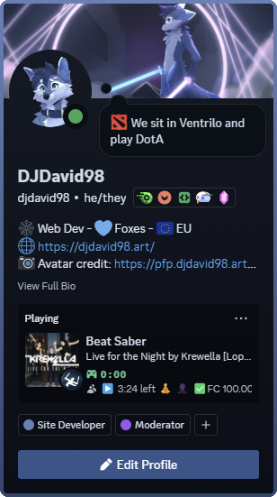
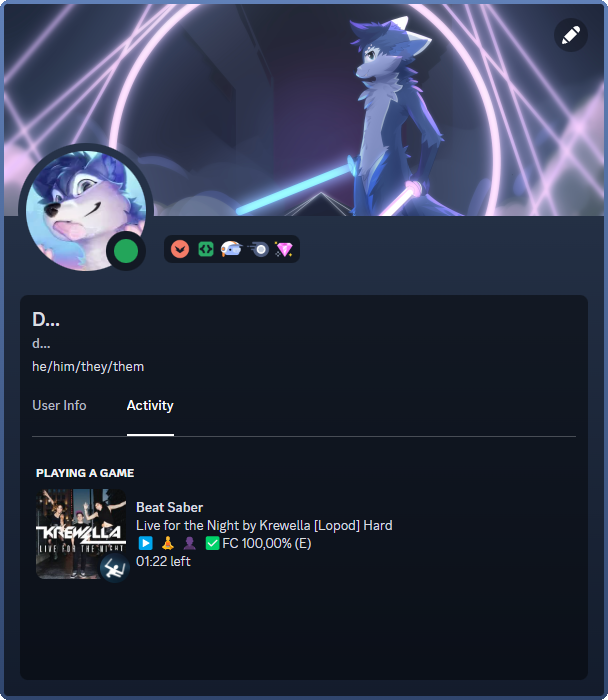

# bsrpc

Discord Rich Presence support for Beat Saber. No customization options whatsoever, because I'm too lazy to add them (sorry).

    
    

## Dependencies

* BSIPA v4.2.2 (ModAssistant)
* DiscordCore v3.0.0 (https://github.com/DJDavid98/DiscordCore/releases/tag/v3.0.0)
* DataPuller v2.1.1 (https://github.com/ReadieFur/BSDataPuller/releases/tag/2.1.1)