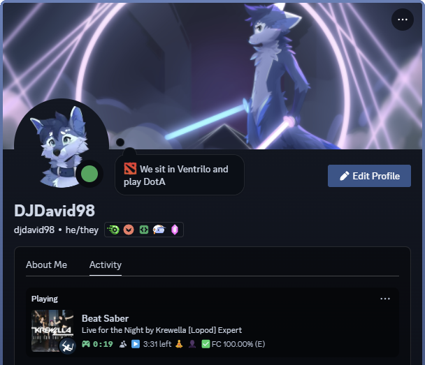

# bsrpc

Discord Rich Presence support for Beat Saber, now with 100% more configurability!

Displays information about the current song (including ranked status), modifiers (as emojis), play/pause state, multi/singleplayer, current score, combo and accuracy by default. Time left is also displayed while playing (speed modifiers are also accounted for).

> [!IMPORTANT]  
> Please wait around 30-60s after launching the game for the Rich Presence to appear, it can take some time after starting the game.

    
    
    
Credits: Profile picture by <a href="https://trello.com/b/mkodBTJD/bels-commission-queue">BelvorDraws</a>, banner by <a href="https://trello.com/b/lL6rPAhd/zell-commissions">Zell</a>

 
## Configuration

While the mod has a few basic configuration options exposed on the UI via the Mod Settings menu, currently most config options can be edited via the JSON file primarily, as I have no idea how to create an interface for some of these options. If you happen to be well-versed in creating in-game configuration UIs any help would be greatly appreciated.

### `DiscordClientId`

Can be used to provide a custom [Discord App ID] in case you want to define your own image files, or change the first line of the Rich Presence, as that's controlled by the App's name.

[Discord App ID]: https://discord.com/developers/applications

The default is an App ID created by the mod's author that works with the default configuration of the mod.

If you want to create your own App, you will need to upload image assets with specific names to match the ones defined in the mod. See the [RichPresenceResources.cs](./RichPresenceResources.cs) file for exact names.

### `MultiplayerDetection`

When `true` the mod will detect when you are in the built-in Multiplayer menu. It will also change the "lobby type" displayed in later steps.

### `MultiplayerPartyInfo`

When `true` and `MultiplayerDetection` is also enabled, the mod will display the size of the lobby as well as the number of people in it inside the rich presence.

### `LargeImageSongCover`

When `true` the mod sets the song cover image as the large image, if it's available. It only works for songs available on BeatSaver, and can be set to `false` to show the image of the current envorment instead, which is also used as a fallback in case no cover art is available.

### `ShowElapsedTimes`

When `true` the amount of time spent in the Main Menu or Multiplayer Lobby is displayed. The timer resets after starting a map or going in and out of a lobby.

### `ShowMapType`

When `true` the map type (standard, one-saber, 360, etc.) will be displayed as the small image for the rich presence. The `SmallTextFormat` tooltip configured later will not be readable if this is set to `false`.

### `UseEndTime`

When `true` the "end time" for the rich presence activity is calculated and set dynamically based on the current song speed modifiers while actively playing a map. When set to `false`, only the "start time" will ever be set. 

> [!NOTE]
> Since Discord's new activity history update the activity no longer shows a timer in the activity details when an end time is set.
> When this is set to `true` your activity will report no visible time progress while playing a map. In order to work around this,
> the new `remainingTimePlaying` field has been introduced to show the remaining time in a similar manner only while the game is not paused.

### `TrackLastSceneSwitch` (Per-Activity Start Time)

When `false` the activity start time is set to (roughly) when the game was opened and will not change when switching between menus and playing a map. Useful if you want to show your total playtime instead of time spent in a level for example.

> [!NOTE]
> Since Discord's new activity history tracks time spent in games differently, this setting is off by default.
> If you want to go back to the previous behavior, you can enable this setting, but I take no responsibility for incorrectly displayed play times.
> You can still show time-based map progress information in the other parts of the rich presence by using the newly-introduced time variables.

### `MapType`

This can be used to change the text displayed when using the `mapType` variable. Set the value to the text you want to see displayed, or an empty string to prevent that value from being displayed. `Fallback` can be set if you want a specific text to be displayed in case the map type being reported by the DataPuller mod does not have a readable name mapping. By default this is `null` and it will display the value sent by DataPuller.

### Data Line Formatting

There are several options which accept "format lists":

* `DetailsFormat` - the 2nd line of the rich presence (below the app name) while playing a song
* `StateFormat` - the 3rd line of the rich presence while playing a song
* `LargeTextFormat` - tooltip displayed when hovering over the large image
* `SmallTextFormat` - tooltip displayed when hovering over the small image

Each string in the list will only be appended to the final output in case it has a "valid" value (valid is subjective and it is defined by the mod). Each value in the list takes the form of `"prefix{{variable}}suffix"` where `prefix` and `suffix` can be an arbitrary number of characters before and after the variable, respectively, and `variable` is the name of the variable from the table below.

The strings also have configurable separators that go between each valid item. By default this is a space for `DetailsFormat` and `StateFormat`, and a slash surrounded by spaces (` / `) for `LargeTextFormat` and `SmallTextFormat`. You can also disable displaying the individual lines by setting them to `null` instead of the list.

| Variable             | Description                              | Example                     | Additional formatting              | Validity criteria     |
|----------------------|------------------------------------------|-----------------------------|------------------------------------|-----------------------|
| songName             | Title of the song                        | Country Roads               |                                    | Not empty             |
| songSubName          | Sub-name of the song                     | Squeepo Remix               |                                    | Not empty             |
| songAuthor           | Author of the song                       | Jaroslav Beck, Kings & Folk |                                    | Not empty             |
| mapper               | Mapper + lighter names (comma separated) | Mawntee, tychailatte        |                                    | Not empty             |
| mappers              | Mapper names (comma separated)           | altrevin, Freek             |                                    | Not empty             |
| lighters             | Lighter names (comma separated)          | altrevin, Freek             |                                    | Not empty             |
| contentRating        | Map content rating                       | Safe                        |                                    | Not empty             |
| difficulty           | Human-readable difficulty                | Expert                      | "ExpertPlus" replaced by "Expert+" | Not empty             |
| customDifficulty     | Custom difficulty name                   | Lawless                     |                                    | Not empty             |
| ranked               | Ranked text                              | ⭐                           | Based on configuration             | If map is ranked      |
| qualified            | Qualified text                           | ✨                           | Based on configuration             | If map is ranked      |
| stars                | ScoreSaber ranked stars                  | 4,22                        | Up to two decimals                 | Greater than 0        |
| blstars              | BeatLeader ranked stars                  | 6,98                        | Up to two decimals                 | Greater than 0        |
| pp                   | ScoreSaber perofrmance points            | 167,89                      | Up to two decimals                 | Greater than 0        |
| playState            | Emoji indicating play state              | ▶️                          | Based on configuration             | Not empty             |
| modifiersState       | Emojis indicating modifiers              | 🧘                          | Based on configuration             | Not empty             |
| lobbyType            | Single/multiplayer or practice           | 👤                          | Based on configuration             | Not empty             |
| mapType              | Type of the current map                  | One Saber                   | Based on configuration             | Not empty             |
| score                | Total score                              | 123,456                     |                                    | Greater than 0        |
| topScore             | Top score for mode and difficulty        | 156,789                     |                                    | Greater than 0        |
| combo                | Consecutive hits without misses          | 234                         | No decimals                        | Greater than 0        |
| misses               | Totall misses & bad cuts                 | 12                          | No decimals                        | Greater than 0        |
| energy               | Player health                            | 90                          | 0-100, no % sign                   |                       |
| bpm                  | Song beats per minute                    | 180                         | No decimals                        | Greater than 0        |
| njs                  | Song note jump speed                     | 14,21                       | Up to two decimals                 | Greater than 0        |
| accuracy             | Current accuracy                         | 86,24                       | Two decimals, excluding % sign     |                       |
| rank                 | Accuracy ranking letter                  | SS                          |                                    | Not empty             |
| bsr                  | BSR key of custom maps                   | 97f6                        |                                    | Not empty             |
| fc                   | Full combo text                          | ✅FC                         | Based on configuration             | No misses & not empty |
| gameVersion          | Version of the game                      | 1.29.1                      |                                    | Not empty             |
| pluginVersion        | Version of the mod                       | 1.1.2                       |                                    | Not empty             |
| remainingTime        | Time left in the current map             | 1:23                        |                                    |                       |
| elapsedTime          | Time elapsed in the current map          | 0:42                        |                                    |                       |
| totalTime            | Total duration of the map                | 2:05                        |                                    |                       |
| remainingTimePlaying | `remainingTime` while playing            | 2:05                        |                                    | Game is not paused    |
| pausedSince          | Time elapsed since the game was paused   | 5:22                        |                                    | Game is paused        |

### `FullComboValue`

This can be used to change the text displayed when using the `fullCombo` variable. Set the value to the text you want to see displayed, or an empty string to prevent that value from being displayed.

### `MainMenuValue`

This controls the 2nd line of the rich presence while in the main menu. Set the value to the text you want to see displayed, or an empty string to prevent that value from being displayed.

### `MultiplayerLobbyValue`

This controls the 2nd line of the rich presence while in a multiplayer lobby. Set the value to the text you want to see displayed, or an empty string to prevent that value from being displayed.

### Emoji configuration

The `PlayStateEmoji`, `ModifierEmoji` and `LobbyTypeEmoji` options allow you to remap the emoji displayed in the `playState`, `modifiersState` and `lobbyType` variables. Set the value to the emoji (or any arbitrary text) you want to see displayed, or an empty string to prevent that value from being displayed.

## Dependencies

* BSIPA v4.3.3 (ModAssistant)
* BeatSaberMarkupLanguage v1.12.1 (ModAssistant)
* DiscordCore v3.0.6 (https://github.com/DJDavid98/DiscordCore/releases/tag/v3.0.6)
* DataPuller v2.1.14 (https://github.com/DJDavid98/BSDataPuller/releases/tag/2.1.14)
